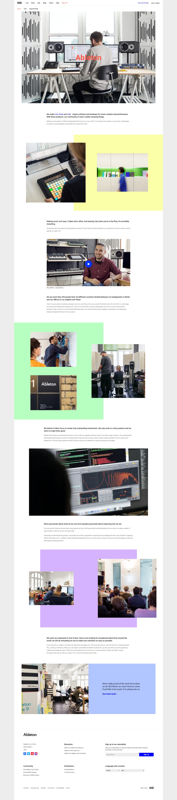
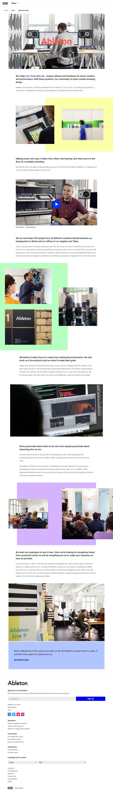
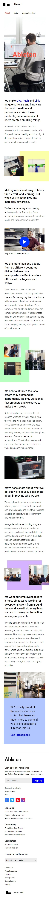
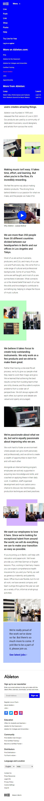

  <h3>
    <a href="https://vetri-suriya.web.app/clone-projects/ableton/">Preview</a> |
    <a href="https://codepen.io/vetrisuriya/pen/oNGoQzP">Codepen</a> |
    <a href="https://github.com/vetrisuriya/ableton-clone">Github</a>
  </h3>

<!-- TABLE OF CONTENTS -->

## Table of Contents

- [Overview](#overview)
- [Screenshots](#screenshots)
- [Built With](#built-with)
- [Contact](#contact)

## Overview

- Frontend Practice [Ableton About Page](https://www.frontendpractice.com/project/ableton)
- Original Website [Ableton About Page](https://www.ableton.com/en/about/)

## Screenshots

  
 &nbsp;&nbsp;&nbsp;&nbsp;&nbsp;&nbsp;&nbsp;  &nbsp;&nbsp;&nbsp;&nbsp;&nbsp;&nbsp;&nbsp;&nbsp;&nbsp;&nbsp;&nbsp;&nbsp;&nbsp;&nbsp;&nbsp; 

## Built With

- [HTML5](#!)
- [CSS3](#!)
- [Javascript](#!)
- [SASS](#!)

## Contact

- Website [vetri-suriya](https://vetri-suriya.web.app/)
- GitHub [vetrisuriya](https://github.com/vetrisuriya)
- Codepen [vetrisuriya](https://codepen.io/vetrisuriya)
- Linkedin [vetri-suriya](https://www.linkedin.com/in/vetri-suriya/)